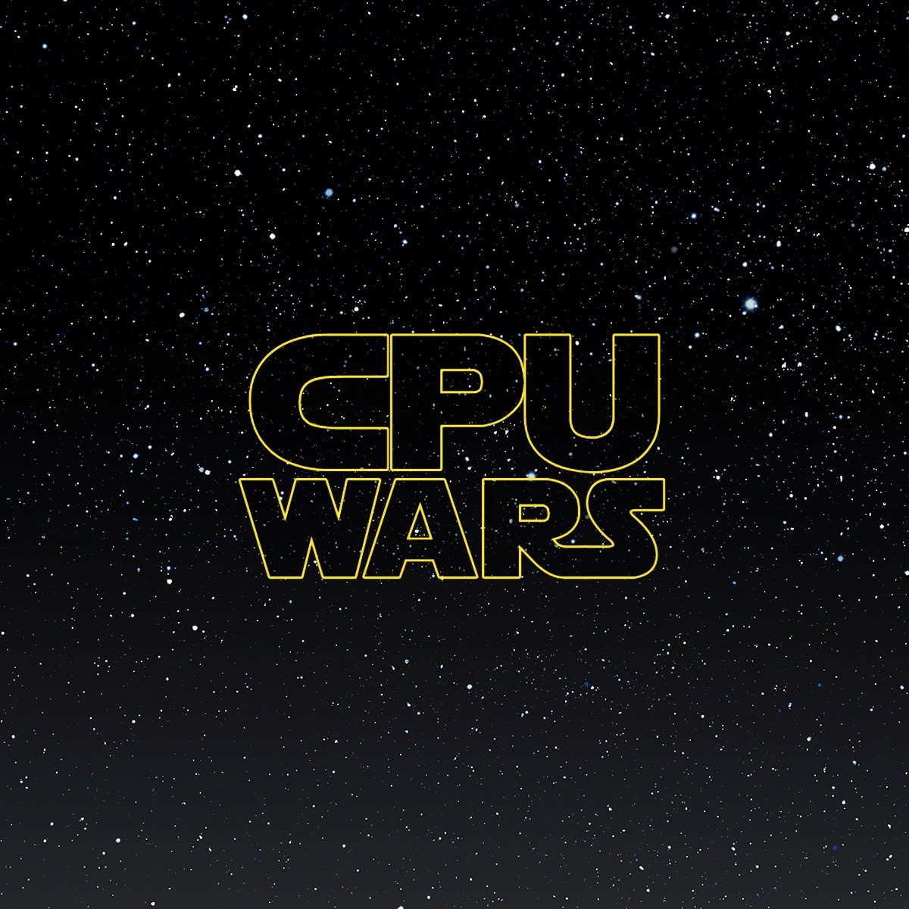

# MiniCPU

Atividade de Infraestrutura de Hardware feita em grupo (10 pessoas): simulador da **MiniCPU** de 8 bits em **C**, executando o ciclo **Fetch → Decode → Execute** e resolvendo o desafio do **Grupo 4 — Máximo de array**.

## Equipe
<table>
  <tbody>
    <tr>
      <td align="center" valign="top" width="14.28%"><a href="https://github.com/Torzinus"> <b>Heitor de Carvalho</b></a> </td>
      <td align="center" valign="top" width="14.28%"><a href="https://larissagiovanna.github.io/LarissaGiovanna/"> <b>Larissa Giovanna</b></a> </td>
      <td align="center" valign="top" width="14.28%"><a href="https://github.com/RiosGabri"> <b>Gabriel Parméra</b></a> </td>
      <td align="center" valign="top" width="14.28%"><a href="https://github.com/LuisHigino"> <b>Luis Higino</b></a> </td>
      <td align="center" valign="top" width="14.28%"><a href="https://github.com/eduardommb"> <b>Eduardo Braga</b></a> </td>
      <td align="center" valign="top" width="14.28%"><a href="https://github.com/MGBcode"> <b>Matheus Britto</b></a> </td>
    </tr>
    <tr>
      <td align="center" valign="top" width="14.28%"><a href="https://github.com/eliancunha"> <b>Elian Cunha</b></a> </td>
      <td align="center" valign="top" width="14.28%"><a href="https://github.com/Luufernaandes"> <b>Luana Fernandes</b></a> </td>
      <td align="center" valign="top" width="14.28%"><a href="https://github.com/Igor-mn"> <b>Igor Moura</b></a> </td>
      <td align="center" valign="top" width="14.28%"><a href="https://github.com/vfmns-arch"> <b>Vinícius Mousinho</b></a> </td>
    </tr>
  </tbody>
</table>

